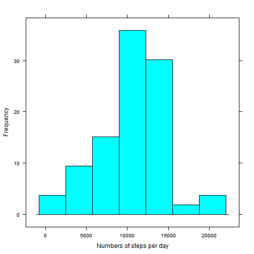
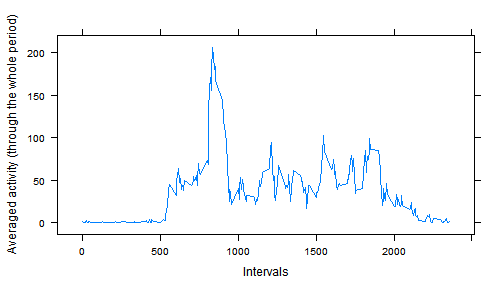
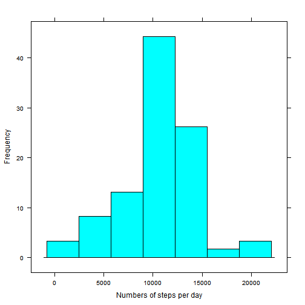
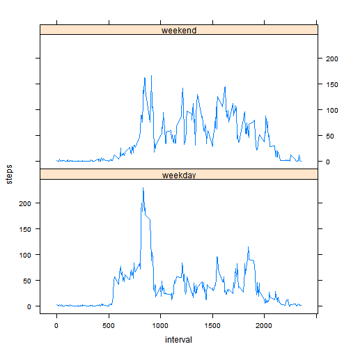

# Introduction

In this document we dig into the data from a personal activity monitoring device, collected during two months from anonymous individual, counting the number of steps made during 5 minutes intervals during the 24 hours every day.

We attempt to understand daily activity patterns, explore the data to find differences between activity during weekends and weekdays and understand the impact of missing values on our understanding. 

# Data description

The **dataset** used for analysis is avaliable [here](https://d396qusza40orc.cloudfront.net/repdata%2Fdata%2Factivity.zip/)

The **variables** included in this dataset are:  

- steps: Number of steps taking in a 5-minute interval (missing values are coded as NA)  
- date: The date on which the measurement was taken in YYYY-MM-DD format  
- interval: Identifier for the 5-minute interval in which measurement was taken  

# System, R version and packages

We used knitr and lattice packages. We also changed time locale from polish to us english for code readability. sessionInfo() is as below:

R version 3.1.1 (2014-07-10)
Platform: x86_64-w64-mingw32/x64 (64-bit)

locale:
[1] LC_COLLATE=Polish_Poland.1250      LC_CTYPE=Polish_Poland.1250       
[3] LC_MONETARY=Polish_Poland.1250     LC_NUMERIC=C                      
[5] LC_TIME=English_United States.1252

attached base packages:
[1] stats     graphics  grDevices utils     datasets  methods   base     

other attached packages:
[1] lattice_0.20-29 knitr_1.6      

loaded via a namespace (and not attached):
 [1] digest_0.6.4    evaluate_0.5.3  formatR_1.0     grid_3.1.1     
 [5] htmltools_0.2.6 markdown_0.7.4  mime_0.2        rmarkdown_0.3.8
 [9] stringr_0.6.2   tools_3.1.1     yaml_2.1.11 

# Setting the locale and loading packages

We change time locale to have english names of days, for better understanding and load knitr and lattice packages.

```r
Sys.setlocale("LC_TIME", "English")
```

```
## [1] "English_United States.1252"
```

```r
library(knitr)
library(lattice)
```

# Loading and preprocessing the data

Since the dataset was already included in repository, we only read it, without downloading it from the web:


```r
unzip("./activity.zip", exdir = getwd() )
activityData<-read.csv("./activity.csv", header = TRUE, sep = ",")
activityData$date<-as.Date(activityData$date)
```

We agregate the data, to see activity patterns later.


```r
activityAgreggate<-aggregate(steps ~ interval, data = activityData, FUN = "mean", na.rm=TRUE) 

daysAggregate<-aggregate(steps~date, data = activityData, FUN = "sum", na.rm=TRUE)
```


# Activity patterns  
  

## What is mean total number of steps taken per day?


```r
histogram(daysAggregate$steps, xlab = "Numbers of steps per day", ylab = "Frequency")
```

 

```r
mean<-mean(daysAggregate$steps)
median<-median(daysAggregate$steps)
```

As we can see from the histogram, on most days number of steps per day is between the 10000 and 15000, with the mean of number of steps equals to 1.0766 &times; 10<sup>4</sup>, and median to 10765.

*Note that so far we simply omitted missing values from the data set.*

## What is the average daily activity pattern?

It is easy to identify where generally (on average) to find the activity peak:


```r
xyplot(steps ~ interval, data = activityAgreggate, type = 'l', xlab = "Intervals", ylab ="Averaged activity (through the whole period)")
```

 

```r
peakInterval<-activityAgreggate$interval[which.max(activityAgreggate$steps)]
```

The interval which has maximum avaraged number of steps is 835.

## Imputing missing values


```r
sum<-sum(is.na(activityData$steps))
```

There are 2304 missing values in the data set. We will replace them with respective values of averaged number of steps in these intervals, in new data set, equal with activityData set.


```r
completeActivityData<-activityData

for (i in 1:nrow(completeActivityData)) {

if (is.na(completeActivityData$steps[i])) {
index<-as.character(completeActivityData$interval[i])
completeActivityData$steps[i]<-round(meanOfStepsPerInterval[[index]])
}

}
```

How does the histogram of total number of steps look like now ?


```r
daysCompleteAggregate<-aggregate(steps~date, data = completeActivityData, FUN = "sum")
histogram(daysCompleteAggregate$steps, xlab = "Numbers of steps per day", ylab = "Frequency")
```

 

```r
completeMean<-mean(daysCompleteAggregate$steps)
completeMedian<-median(daysCompleteAggregate$steps)
```

Comparing to previous one, there appear to be more days in which total number of steps is arround 10000, while the frequencies of other sums decreased.

Comparison of old mean - 1.0766 &times; 10<sup>4</sup> and new mean - 1.0766 &times; 10<sup>4</sup> shows no difference, while old median - 10765 appears to be slightly bigger than new one - 1.0762 &times; 10<sup>4</sup>. 

## Are there differences in activity patterns between weekdays and weekends?

At first we create new character variable in the data set, which describes 
what day was the measure measured.


```r
completeActivityData$dayType<-weekdays(completeActivityData$date)
```

Next we classify if the day was the weekday or weekend day and transform dayType variable to factor type.


```r
for (i in 1:nrow(completeActivityData)) {

if (completeActivityData$dayType[i] %in% c( "Saturday","Sunday")){
        completeActivityData$dayType[i]<-"weekend"
}

else {
completeActivityData$dayType[i]<-"weekday"

}

}
completeActivityData$dayType = factor(completeActivityData$dayType, levels = c("weekday","weekend"))
```

We repeat aggregation step, this time taking into account also dayType and plot the panel.


```r
completeAgreggate<-aggregate(steps ~ interval + dayType, data = completeActivityData, FUN = "mean") 

xyplot(steps ~ interval | dayType, data = completeAgreggate, 
       type = 'l', layout = c(1,2))
```

 


